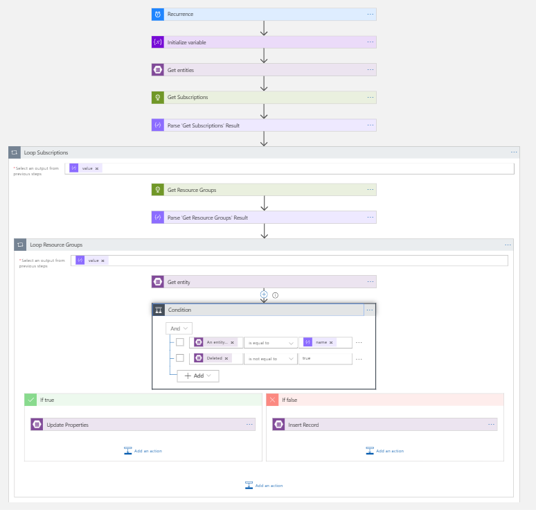
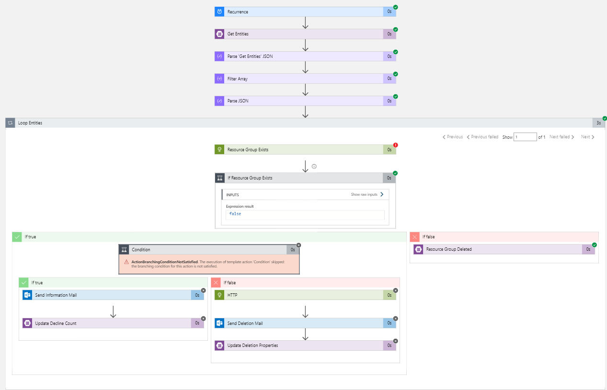

# garbage-collector
## Installation
* Clone solution and deploy each project within the solution into the same resource group
* Authorize API for Office 365 for each Logic App with the O365 mail account previously created
* Make sure the installation account has Owner permission on both source (where Garbage Collector will be installed) and target subscription. After the installation (execution of the script below) the Owner permission can be removed on the target subscription.
* Run the Powershell code in ./AfterDeployment.ps1

## Inventory/Get-Workflow

## Delete-Workflow

